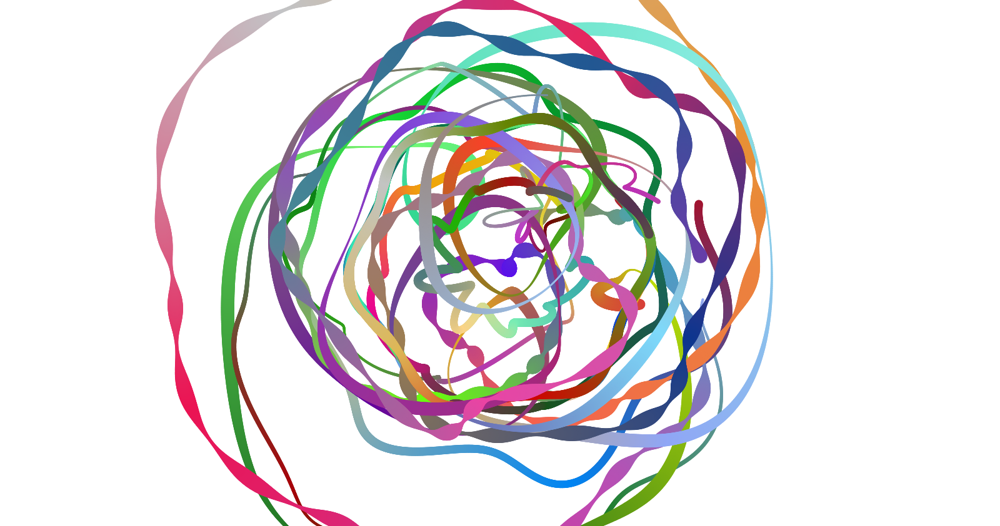

# The Pendulum
>This art project draws pendulums on the canvas.

## Website
The project is live at [thependel.art](https://thependel.art).

## Future Ideas

### Fading Out
It would be very appealing if each pendulum has an additional fade duration after which the drawn line disappears. Unfortunately, the things I tried out weren't satisfatory:
1. clear canvas and redraw everything which didn't fade out
    * very slow
2. clear canvas and redraw everything through `bezierCurve` in big steps (e.g. 45°)
    * a lot faster than 1. (still very unefficient)
    * redrawing doesn't result in the same image
3. [fabric.js](http://fabricjs.com/)
    * tried with Polylines and with grouped Lines
    * both too slow
